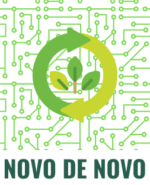

<!-- PROJECT LOGO -->
<br />
<p align="center">
  <a href="https://github.com/othneildrew/Best-README-Template">
    
    
  </a>

  <h2 align="center">Hackathon CCR 2ª Edição</h2>
  <h3 align="center">Projeto Novo de Novo</h3>

<!-- ABOUT THE PROJECT -->

## Sobre o projeto


Nossa solução consiste em utilizar nossa central de tratamento de lixo eletrônico que emprega primariamente jovens. Queremos que essas pessoas participem de forma ativa no processo de triagem, separação e restauração de equipamentos eletrônicos, de forma guiada e supervisionada para que haja aprendizado e capacitação profissional. Durante o estágio, o jovem estará apto a levar para si um computador que restaurou utilizando do conhecimento adquirido.

### Construído com

- React Native
- Typescript
- Node.js
- React

## Instruções para rodar o projeto na sua máquina

### Pré-requisitos

Lista de softwares necessários para rodar o projeto na máquina

- `npm`: node package manager
  ```sh
  npm install npm@latest -g
  ```
- `yarn`

  ```sh
  curl -sS https://dl.yarnpkg.com/debian/pubkey.gpg | sudo apt-key add -
  echo "deb https://dl.yarnpkg.com/debian/ stable main" | sudo tee /etc/apt/sources.list.d/yarn.list

  sudo apt update && sudo apt install yarn
  ```

### Instalação

1. Clone o repositório
   ```sh
   git clone https://github.com/hacka-ccr/ccr-web
   ```
2. Instale os pacotes NPM utilizando o `yarn`
   ```sh
   yarn
   ```
   <!-- USAGE EXAMPLES -->

## Uso

Após verificar que todas os pré-requisitos são cumpridos e instalar o repositório, para utilizá-lo, basta executar um único comando:

```sh
yarn start
```

Isso dará início ao projeto no endereço `localhost:3000`

   <!-- USAGE EXAMPLES -->

<!-- LICENSE -->

## License

Distribuído sob a licença MIT. Veja `LICENSE` para mais informações.
